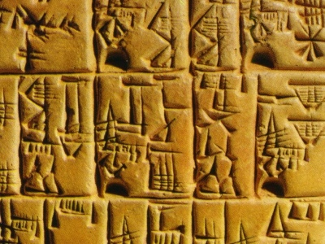

  
[Intangible Textual Heritage](../../../index)  [Ancient Near
East](../../index)  [Records of the Past](../index) 
[Egypt](../../../egy/index) 

------------------------------------------------------------------------

<table width="75%">
<colgroup>
<col style="width: 50%" />
<col style="width: 50%" />
</colgroup>
<tbody>
<tr class="odd">
<td width="50%" data-valign="TOP"></td>
<td width="50%" data-valign="CENTER"><h1 id="records-of-the-past-2nd-series-vol.-4" data-align="CENTER">Records of the Past 2nd Series, Vol. 4</h1>
<h2 id="ed.-by-a.h.-sayce" data-align="CENTER">ed. by A.H. Sayce</h2>
<h4 id="section" data-align="CENTER">[1890]</h4></td>
</tr>
</tbody>
</table>

------------------------------------------------------------------------

[Contents](#contents)    [Start Reading](rp20400)    [Page
Index](pageidx)    [Text \[Zipped\]](rp204.txt.gz)

------------------------------------------------------------------------

This installment of the Records of the Past includes numerous historical
stelae, extremely valuable for the study of ancient geography and
history. The place names in these records of conquest by such figures as
Shalmaneser II and Assur-Natsir-Pal range over the ancient Near East as
far afield as Armenia.

------------------------------------------------------------------------

 [Title Page](rp20400)  
[Preface](rp20401)  
[Table of Contents](rp20402)  
[Equivalents of the Hebrew Letters](rp20403)  

### The Official Life of an Egyptian Officer

[Introduction](rp20404)  
[Text](rp20405)  

### Hymn to Osiris

[Introduction](rp20406)  
[Text](rp20407)  

### The Synchronous History of Assyria and Babylonia

[Introduction](rp20408)  
[Text](rp20409)  

### Inscriptions of Shalmaneser II

[Introduction](rp20410)  
[Text](rp20411)  

### The Monolith Inscription of Shalmaneser II

[Introduction](rp20412)  
[Text](rp20413)  

### The Inscription of Shalmaneser II

[Introduction](rp20414)  
[Text](rp20415)  

### A Votive Inscription of Assur-Natsir-Pal

[Introduction](rp20416)  
[Text](rp20417)  

### Inscription of Rimmon-Nirari III

[Introduction](rp20418)  
[Text](rp20419)  

### Votive Inscriptions

[Introduction](rp20420)  
[Text](rp20421)  

### Babylonian Contract-Tablets with Historical References

[Introduction](rp20422)  
[Text](rp20423)  

### The Dedication of Three Babylonians to the Service of the Sun-God at Sippara

[Introduction](rp20424)  
[Text](rp20425)  

### The Great Inscription of Argistis on the Rock of Van

[Introduction](rp20426)  
[Text](rp20427)  

### Monolith Inscription of Argistis, King of Van

[Introduction](rp20428)  
[Text](rp20429)  
