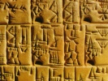

  
[Intangible Textual Heritage](../../../index)  [Ancient Near
East](../../index)  [Records of the Past](../index) 
[Egypt](../../../egy/index)  [Index](index)  [Previous](rp20419) 
[Next](rp20421) 

------------------------------------------------------------------------

  
*Records of the Past, 2nd Series, Vol. IV* , ed. by A.H. Sayce,
\[1890\], at Intangible Textual Heritage

------------------------------------------------------------------------

p. 90

### VOTIVE INSCRIPTIONS

#### Translated by S. Arthur Strong

#### I

The following inscription is on a stone
lion found at the entrance of a temple at the foot of the pyramid at
Nimrud, and now in the British Museum. It is an invocation to Beltis,
the female counterpart or shadow of Bel, and forms an introduction to
one of the frequent versions of the standard inscription of
Assur-natsir-pal. In line 7 Ishtar, though she appears to be invoked as
a separate goddess, is probably to be regarded as an equivalent or
personification of Beltis. However, the process by which she assumed the
titles, and eventually absorbed the personality of the latter, was a
gradual one, and its final stage becomes visible only in inscriptions of
the second Assyrian period, particularly in those of Assurbanipal. [1](#fn_387)

The inscription has been published in the second volume of "The
Cuneiform Inscriptions of Western Asia," plate 66, No. I. Lines 7 to 9
have been translated by Zimmern in *Babylonische Busspsalmen*,

p. 91

p\. 22, and notes on two other isolated passages will be found on pp.
197 and 256 of Jensen's *Kosmologie der Babylonier;* but it seems that
no complete translation has hitherto been published.

The lines as they are given in *W. A. I.*, ii. do not represent the
arrangement of the original, but I follow them for convenience of
reference.

------------------------------------------------------------------------

### Footnotes

[90:1](rp20420.htm#fr_390) See Sayce, *Hibbert
Lectures*, p. 273.

------------------------------------------------------------------------

[Next: Text](rp20421)
