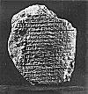

  
[Intangible Textual Heritage](../../index)  [Ancient Near
East](../index)  [Index](index)  [Next](sum01) 

------------------------------------------------------------------------

[  
Click to enlarge](img/front.jpg)

# MAN'S GOLDEN AGE

This tablet (29.16.422 in the Nippur collection of the University
Museum) is one of the unpublished pieces belonging to the Sumerian epic
poem [1](sum10.htm#xref_1) whose hero Enmerkar ruled in the city of
Erech sometime during the fourth millennium B. C. The passage enclosed
by the black line describes the blissful and unrivalled state of man in
an era of universal peace before he had learned to know fear and before
the "confusion of tongues"; its contents, [2](sum10.htm#xref_2) which
are very reminiscent of Genesis XI:1, read as follows:

In those days there was no snake, there was no scorpion, there was no
*hyena*,  
There was no lion, there was no *wild dog*, no wolf,  
There was no fear, no terror,  
Man had no rival.

In those days the land Shubur (East), the place of plenty, of righteous
decrees,  
*Harmony-tongued* Sumer (South), the great land of the "decrees of
princeship,"  
Uri (North), the land having all that is *needful*,  
The land Martu (West), resting in security,  
The whole universe, the people *in unison*,  
To Enlil in one tongue *gave praise*.

 

------------------------------------------------------------------------

[Next: Title Page](sum01)
