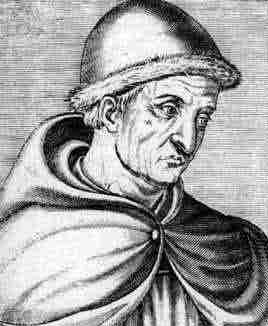

[Intangible Textual Heritage](../../index)  [Age of Reason](../index) 

------------------------------------------------------------------------

# Roger Bacon

[Friar Bacon: His Discovery of the Miracles Of Art, Nature, And
Magick](miracle)  
by Roger Bacon \[1659\].  
This etext was graciously donated to sacred-texts by Dr. Alan R. Young,
Ph.D.  
Roger Bacon can be placed on the boundary between magic and science.
This essay starts with a strong dissenting opinion on the existence of
magic; but finishes by discussing how to create a 'Philosophers Egg'. In
between, Bacon writes about the use of optics, gunpowder, and petroleum
in warfare. In fact, Bacon is believed to have introduced gunpowder (a
Chinese invention) to the West, and the rest, as they say, was history.
He also makes some bold futurist statements, predicting powered ships,
automobiles, flying machines, and scuba gear. As Arthur C. Clarke said,
'Any sufficiently advanced technology is indistinguishable from magic.'
