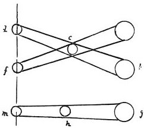

  
[Intangible Textual Heritage](../../index)  [Age of Reason](../index) 
[Index](index)   
[I. Prolegomena and General Introduction to the Book on Painting
Index](dvs000)  
  [Previous](0027)  [Next](0029) 

------------------------------------------------------------------------

[Buy this Book at
Amazon.com](https://www.amazon.com/exec/obidos/ASIN/0486225720/internetsacredte)

------------------------------------------------------------------------

*The Da Vinci Notebooks at Intangible Textual Heritage*

### 28.

p. 21

The motion of a spectator who sees an object at rest often makes it seem
as though the object at rest had acquired the motion of the moving body,
while the moving person appears to be at rest.

### ON PAINTING.

 

Objects in relief, when seen from a short distance with one eye, look
like a perfect picture. If you look with the eye *a*, *b* at the spot
*c*, this point *c* will appear to be at *d*, *f*, and if you look at it
with the eye *g*, *h* will appear to be at *m*. A picture can never
contain in itself both aspects.

------------------------------------------------------------------------

[Next: 29.](0029)
