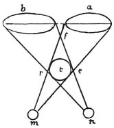

  
[Intangible Textual Heritage](../../index)  [Age of Reason](../index) 
[Index](index)   
[I. Prolegomena and General Introduction to the Book on Painting
Index](dvs000)  
  [Previous](0028)  [Next](0030) 

------------------------------------------------------------------------

[Buy this Book at
Amazon.com](https://www.amazon.com/exec/obidos/ASIN/0486225720/internetsacredte)

------------------------------------------------------------------------

*The Da Vinci Notebooks at Intangible Textual Heritage*

### 29.

 

Let the object in relief *t* be seen by both eyes; if you will look at
the object with the right eye *m*, keeping the left eye *n* shut, the
object will appear, or fill up the space, at *a*; and if you shut the
right eye and open the left, the object (will occupy the) space *b*; and
if you open both eyes, the object will no longer appear at *a* or *b*,
but at *e*, *r*, *f*. Why will not a picture seen by both eyes produce
the effect of relief, as \[real\] relief does when seen by both eyes;
and why should a picture seen with one eye give the same effect of
relief as real relief would under the same conditions of light and
shade?

 [21](#fn_23)

------------------------------------------------------------------------

### Footnotes

[21:21](0029.htm#fr_23) : In the sketch, *m* is
the left eye and *n* the right, while the text reverses this lettering.
We must therefore suppose that the face in which the eyes *m* and *n*
are placed is opposite to the spectator.

------------------------------------------------------------------------

[Next: 30.](0030)
