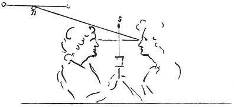

  
[Intangible Textual Heritage](../../index)  [Age of Reason](../index) 
[Index](index)   
[I. Prolegomena and General Introduction to the Book on Painting
Index](dvs000)  
  [Previous](0036)  [Next](0038) 

------------------------------------------------------------------------

[Buy this Book at
Amazon.com](https://www.amazon.com/exec/obidos/ASIN/0486225720/internetsacredte)

------------------------------------------------------------------------

*The Da Vinci Notebooks at Intangible Textual Heritage*

### 37.

Experiment \[showing\] the dilatation and contraction of the pupil, from
the motion of the sun and other luminaries. In proportion as the sky is
darker the stars appear of larger size, and if you were to light up

p. 24

 

the medium these stars would look smaller; and this difference arises
solely from the pupil which dilates and contracts with the amount of
light in the medium which is interposed between the eye and the luminous
body. Let the experiment be made, by placing a candle above your head at
the same time that you look at a star; then gradually lower the candle
till it is on a level with the ray that comes from the star to the eye,
and then you will see the star diminish so much that you will almost
lose sight of it.

 [24](#fn_26)

------------------------------------------------------------------------

### Footnotes

[24:24](0037.htm#fr_26) : No reference is made
in the text to the letters on the accompanying diagram.

------------------------------------------------------------------------

[Next: 38.](0038)
