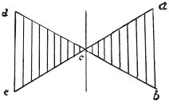

  
[Intangible Textual Heritage](../../index)  [Age of Reason](../index) 
[Index](index)   
[II. Linear Perspective Index](dvs001)  
  [Previous](0046)  [Next](0048) 

------------------------------------------------------------------------

[Buy this Book at
Amazon.com](https://www.amazon.com/exec/obidos/ASIN/0486225720/internetsacredte)

------------------------------------------------------------------------

*The Da Vinci Notebooks at Intangible Textual Heritage*

### 47.

### DEFINITION OF THE NATURE OF THE LINE.

 Of the line (47-48).The line has in
itself neither matter nor substance and may rather be called an
imaginary idea than a real object; and this being its nature it occupies
no space. Therefore

p. 29

an infinite number of lines may be conceived of as intersecting each
other at a point, which has no dimensions and is only of the thickness
(if thickness it may be called) of one single line.

### HOW WE MAY CONCLUDE THAT A SUPERFICIES TERMINATES IN A POINT?

 

An angular surface is reduced to a point where it terminates in an
angle. Or, if the sides of that angle are produced in a straight line,
then--beyond that angle--another surface is generated, smaller, or equal
to, or larger than the first.

------------------------------------------------------------------------

[Next: 48.](0048)
