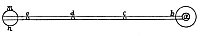
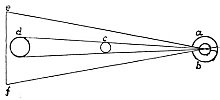

  
[Intangible Textual Heritage](../../index)  [Age of Reason](../index) 
[Index](index)   
[II. Linear Perspective Index](dvs001)  
  [Previous](0051)  [Next](0053) 

------------------------------------------------------------------------

[Buy this Book at
Amazon.com](https://www.amazon.com/exec/obidos/ASIN/0486225720/internetsacredte)

------------------------------------------------------------------------

*The Da Vinci Notebooks at Intangible Textual Heritage*

### 52.

p. 32

 Experimental proof of the existence of the
pyramid of sight (52-55).Perspective is a rational demonstration,
confirmed by experience, that all objects transmit their image to the
eye by a pyramid of lines.

By a pyramid of lines I understand those lines which start from the
edges of the surface of bodies, and converging from a distance, meet in
a single point; and this point, in the present instance, I will show to
be situated in the eye which is the universal judge of all objects. By a
point I mean that which cannot be divided into parts; therefore this
point, which is situated in the eye, being indivisible, no body is seen
by the eye, that is not larger than this point. This being the case it
is inevitable that the lines which come from the object to the point
must form a pyramid. And if any man seeks to prove that the sense of
sight does not reside in this point, but rather in the black spot which
is visible in the middle of the pupil, I might reply to him that a small
object could never diminish at any distance, as it might be a grain of
millet or of oats or of some similar thing, and that object, if it were
larger than the said \[black\] spot would never be seen as a whole; as
may be seen in the diagram below. Let *a*.

[  
Click to enlarge](img/v103200.jpg)

[  
Click to enlarge](img/v103201.jpg)

be the seat of sight, *b e* the lines which reach the eye. Let *e d* be
the grains of millet within these lines. You plainly see that these will
never diminish by distance, and that the body *m n* could not be
entirely covered by it. Therefore you must confess that the eye contains
within itself one single indivisible point *a*, to which all the points
converge of the pyramid of lines starting from an object, as is shown
below. Let *a*. *b*. be the eye; in the centre of it is the point

p. 33

above mentioned. If the line *e f* is to enter as an image into so small
an opening in the eye, you must confess that the smaller object cannot
enter into what is smaller than itself unless it is diminished, and by
diminishing it must take the form of a pyramid.

------------------------------------------------------------------------

[Next: 53.](0053)
