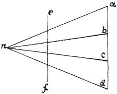

  
[Intangible Textual Heritage](../../index)  [Age of Reason](../index) 
[Index](index)   
[II. Linear Perspective Index](dvs001)  
  [Previous](0052)  [Next](0054) 

------------------------------------------------------------------------

[Buy this Book at
Amazon.com](https://www.amazon.com/exec/obidos/ASIN/0486225720/internetsacredte)

------------------------------------------------------------------------

*The Da Vinci Notebooks at Intangible Textual Heritage*

### 53.

### PERSPECTIVE.

 

Perspective comes in where judgment fails \[as to the distance\] in
objects which diminish. The eye can never be a true judge for
determining with exactitude how near one object is to another which is
equal to it \[in size\], if the top of that other is on the level of the
eye which sees them on that side, excepting by means of the vertical
plane which is the standard and guide of perspective. Let *n* be the
eye, *e f* the vertical plane above mentioned. Let *a b c d* be the
three divisions, one below the other; if the lines *a n* and *c n* are
of a given length and the eye *n* is in the centre, then *a b* will look
as large as *b c. c d* is lower and farther off from *n*, therefore it
will look smaller. And the same effect will appear in the three
divisions of a face when the eye of the painter who is drawing it is on
a level with the eye of the person he is painting.

------------------------------------------------------------------------

[Next: 54.](0054)
