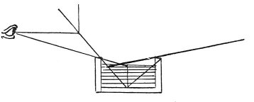

  
[Intangible Textual Heritage](../../index)  [Age of Reason](../index) 
[Index](index)   
[II. Linear Perspective Index](dvs001)  
  [Previous](0074)  [Next](0076) 

------------------------------------------------------------------------

[Buy this Book at
Amazon.com](https://www.amazon.com/exec/obidos/ASIN/0486225720/internetsacredte)

------------------------------------------------------------------------

*The Da Vinci Notebooks at Intangible Textual Heritage*

### 75.

p. 46

 

If the judgment of the eye is situated within it, the straight lines of
the images are refracted on its surface because they pass through the
rarer to the denser medium. If, when you are under water, you look at
objects in the air you will see them out of their true place; and the
same with objects under water seen from the air.

------------------------------------------------------------------------

[Next: 76.](0076)
