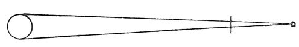
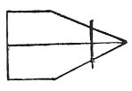

  
[Intangible Textual Heritage](../../index)  [Age of Reason](../index) 
[Index](index)   
[II. Linear Perspective Index](dvs001)  
  [Previous](0084)  [Next](0086) 

------------------------------------------------------------------------

[Buy this Book at
Amazon.com](https://www.amazon.com/exec/obidos/ASIN/0486225720/internetsacredte)

------------------------------------------------------------------------

*The Da Vinci Notebooks at Intangible Textual Heritage*

### 85.

### PERSPECTIVE.

 

The vertical plane is a perpendicular line, imagined as in front of the
central point where the apex of the pyramids converge. And this plane
bears the same relation to this point as a plane of glass would, through
which you might see the various objects and draw them on it. And the
objects thus drawn would be smaller than the originals, in proportion as
the distance between the glass and the eye was smaller than that between
the glass and the objects.

### PERSPECTIVE.

 

The different converging pyramids produced by the objects, will show, on
the plane, the various sizes and remoteness of the objects causing them.

### PERSPECTIVE.

All those horizontal planes of which the extremes are met by
perpendicular lines forming right angles, if they are of equal width the
more they rise to the level of eye the less this is seen, and the more
the eye is above them the more will their real width be seen.

### PERSPECTIVE.

The farther a spherical body is from the eye the more you will see of
it.

------------------------------------------------------------------------

[Next: 86.](0086)
