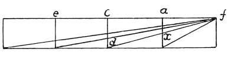

  
[Intangible Textual Heritage](../../index)  [Age of Reason](../index) 
[Index](index)   
[II. Linear Perspective Index](dvs001)  
  [Previous](0102)  [Next](0104) 

------------------------------------------------------------------------

[Buy this Book at
Amazon.com](https://www.amazon.com/exec/obidos/ASIN/0486225720/internetsacredte)

------------------------------------------------------------------------

*The Da Vinci Notebooks at Intangible Textual Heritage*

### 103.

### PERSPECTIVE.

 

Let *f* be the level and distance of the eye; and *a* the vertical
plane, as high as a man; let *e* be a man, then I say that on the plane
this will be the distance from the plane to the 2nd man.

------------------------------------------------------------------------

[Next: 104.](0104)
