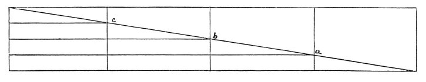

  
[Intangible Textual Heritage](../../index)  [Age of Reason](../index) 
[Index](index)   
[II. Linear Perspective Index](dvs001)  
  [Previous](0103)  [Next](0105) 

------------------------------------------------------------------------

[Buy this Book at
Amazon.com](https://www.amazon.com/exec/obidos/ASIN/0486225720/internetsacredte)

------------------------------------------------------------------------

*The Da Vinci Notebooks at Intangible Textual Heritage*

### 104.

 

The differences in the diminution of objects of equal size in
consequence of their various remoteness from the eye will bear among
themselves the same proportions as those of the spaces between the eye
and the different objects.

Find out how much a man diminishes at a certain distance and what its
length is; and then at twice that distance and at 3 times, and so make
your general rule.

------------------------------------------------------------------------

[Next: 105.](0105)
