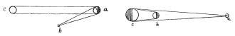

  
[Intangible Textual Heritage](../../index)  [Age of Reason](../index) 
[Index](index)   
[III. Six Books on Light and Shade Index](dvs002)  
  [Previous](0114)  [Next](0116) 

------------------------------------------------------------------------

[Buy this Book at
Amazon.com](https://www.amazon.com/exec/obidos/ASIN/0486225720/internetsacredte)

------------------------------------------------------------------------

*The Da Vinci Notebooks at Intangible Textual Heritage*

### 115.

 

### OF PAINTING.

As regards all visible objects 3 things must be considered. These are
the position of the eye which sees: that of the object seen \[with
regard\] to the light, and the position of the light which illuminates
the object, *b* is the eye, *a* the object seen, *c* the light, *a* is
the eye, *b* the illuminating body, *c* is the illuminated object.

------------------------------------------------------------------------

[Next: 116.](0116)
