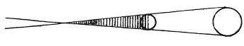

  
[Intangible Textual Heritage](../../index)  [Age of Reason](../index) 
[Index](index)   
[III. Six Books on Light and Shade Index](dvs002)  
  [Previous](0119)  [Next](0121) 

------------------------------------------------------------------------

[Buy this Book at
Amazon.com](https://www.amazon.com/exec/obidos/ASIN/0486225720/internetsacredte)

------------------------------------------------------------------------

*The Da Vinci Notebooks at Intangible Textual Heritage*

### 120.

 

Shadow is the diminution of light by the intervention of an opaque body.
Shadow is the counterpart of the luminous rays which are cut off by an
opaque body.

This is proved because the shadow cast is the same in shape and size as
the luminous rays were which are transformed into a shadow.

------------------------------------------------------------------------

[Next: 121.](0121)
