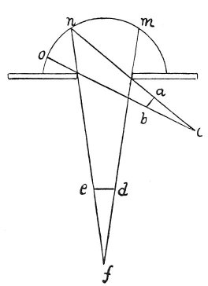

  
[Intangible Textual Heritage](../../index)  [Age of Reason](../index) 
[Index](index)   
[III. Six Books on Light and Shade Index](dvs002)  
  [Previous](0130)  [Next](0132) 

------------------------------------------------------------------------

[Buy this Book at
Amazon.com](https://www.amazon.com/exec/obidos/ASIN/0486225720/internetsacredte)

------------------------------------------------------------------------

*The Da Vinci Notebooks at Intangible Textual Heritage*

### 131.

 

### THE RAYS WHETHER SHADED OR LUMINOUS HAVE GREATER STRENGTH AND EFFECT AT THEIR POINTS THAN AT THEIR SIDES.

Although the points of luminous pyramids may extend into shaded places
and those of pyramids of shadow into illuminated places, and though
among the luminous pyramids one may start from a broader base than
another; nevertheless, if by reason of their various length these
luminous pyramids acquire angles of equal size their light will be
equal; and the case will be the same with the pyramids of shadow; as may
be seen in the intersected pyramids *a b c* and *d e f*, which though
their bases differ in size are equal as to breadth and light.

 [57](#fn_59)

------------------------------------------------------------------------

### Footnotes

[79:57](0131.htm#fr_59) : 51--55: This
supplementary paragraph is indicated as being a continuation of line 45,
by two small crosses.

------------------------------------------------------------------------

[Next: 132.](0132)
