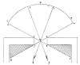

  
[Intangible Textual Heritage](../../index)  [Age of Reason](../index) 
[Index](index)   
[III. Six Books on Light and Shade Index](dvs002)  
  [Previous](0137)  [Next](0139) 

------------------------------------------------------------------------

[Buy this Book at
Amazon.com](https://www.amazon.com/exec/obidos/ASIN/0486225720/internetsacredte)

------------------------------------------------------------------------

*The Da Vinci Notebooks at Intangible Textual Heritage*

### 138.

p. 82

[  
Click to enlarge](img/v108200.jpg)

Every shadow cast by a body has a central line directed to a single
point produced by the intersection of luminous lines in the middle of
the opening and thickness of the window. The proposition stated above,
is plainly seen by experiment. Thus if you draw a place with a window
looking northwards, and let this be *s f*, you will see a line starting
from the horizon to the east, which, touching the 2 angles of the window
*o f*, reaches *d*; and from the horizon on the west another line,
touching the other 2 angles *r s*, and ending at *c*; and their
intersection falls exactly in the middle of the opening and thickness of
the window. Again, you can still better confirm this proof by placing
two sticks, as shown at *g h*; and you will see the line drawn from the
centre of the shadow directed to the centre *m* and prolonged to the
horizon *n f*.

 [60](#fn_62)

------------------------------------------------------------------------

### Footnotes

[82:60](0138.htm#fr_62) : *B* here stands for
*cerchio del' orizonte tramontano* on the original diagram (the circle
of the horizon towards the North); *A* for *levante* (East) and *C* for
*ponete* (West).

------------------------------------------------------------------------

[Next: 139.](0139)
