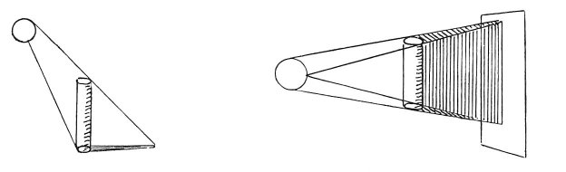

  
[Intangible Textual Heritage](../../index)  [Age of Reason](../index) 
[Index](index)   
[III. Six Books on Light and Shade Index](dvs002)  
  [Previous](0160)  [Next](0162) 

------------------------------------------------------------------------

[Buy this Book at
Amazon.com](https://www.amazon.com/exec/obidos/ASIN/0486225720/internetsacredte)

------------------------------------------------------------------------

*The Da Vinci Notebooks at Intangible Textual Heritage*

### 161.

### OF SIMPLE DERIVED SHADOWS.

The simple derived shadow is of two kinds: one kind which has its length
defined,

 

and two kinds which are undefined; and the defined shadow is pyramidal.
Of the two undefined, one is a column and the other spreads out; and all
three have rectilinear outlines. But the converging, that is the
pyramidal, shadow proceeds from a body that is smaller than the light,
and the columnar from a body equal in size to the light, and the
spreading shadow from a body larger than the light; &c

p. 93

### OF COMPOUND DERIVED SHADOWS.

Compound derived shadows are of two kinds; that is columnar and
spreading.

------------------------------------------------------------------------

[Next: 162.](0162)
