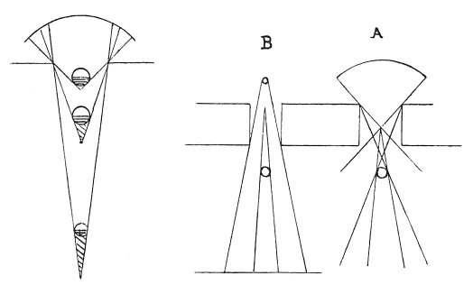

  
[Intangible Textual Heritage](../../index)  [Age of Reason](../index) 
[Index](index)   
[III. Six Books on Light and Shade Index](dvs002)  
  [Previous](0167)  [Next](0169) 

------------------------------------------------------------------------

[Buy this Book at
Amazon.com](https://www.amazon.com/exec/obidos/ASIN/0486225720/internetsacredte)

------------------------------------------------------------------------

*The Da Vinci Notebooks at Intangible Textual Heritage*

### 168.

Both the primary and derived shadow will be larger when caused by the
light of a candle than by diffused light. The difference

 

between the larger and smaller shadows will be in inverse proportion to
the larger and smaller lights causing them.

 [74](#fn_76)

------------------------------------------------------------------------

### Footnotes

[95:74](0168.htm#fr_76) : In the diagrams *A*
stands for *celo* (sky), *B* for *cadela* (candle).

------------------------------------------------------------------------

[Next: 169.](0169)
