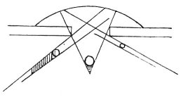

  
[Intangible Textual Heritage](../../index)  [Age of Reason](../index) 
[Index](index)   
[III. Six Books on Light and Shade Index](dvs002)  
  [Previous](0171)  [Next](0173) 

------------------------------------------------------------------------

[Buy this Book at
Amazon.com](https://www.amazon.com/exec/obidos/ASIN/0486225720/internetsacredte)

------------------------------------------------------------------------

*The Da Vinci Notebooks at Intangible Textual Heritage*

### 172.

 

When the light of the atmosphere is restricted \[by an opening\] and
illuminates bodies which cast shadows, these bodies being equally
distant from the centre of the window, that which is most obliquely
placed will cast the largest shadow beyond it.

------------------------------------------------------------------------

[Next: 173.](0173)
