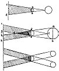

  
[Intangible Textual Heritage](../../index)  [Age of Reason](../index) 
[Index](index)   
[III. Six Books on Light and Shade Index](dvs002)  
  [Previous](0173)  [Next](0175) 

------------------------------------------------------------------------

[Buy this Book at
Amazon.com](https://www.amazon.com/exec/obidos/ASIN/0486225720/internetsacredte)

------------------------------------------------------------------------

*The Da Vinci Notebooks at Intangible Textual Heritage*

### 174.

[  
Click to enlarge](img/v109800.jpg)

### THE FARTHER THE DERIVED SHADOW IS PROLONGED THE LIGHTER IT BECOMES.

You will find that the proportion of the diameter of the derived shadow
to that of the primary shadow will be the same as that between the
darkness of the primary shadow and that of the derived shadow.

 [78](#fn_80) Let *a b* be the diameter of the
primary shadow and *c d* that of the derived shadow, I say that *a b*
going, as you see, three times into *d c*, the shadow *d c* will be
three times as light as the shadow *a b*.  [79](#fn_81)

If the size of the illuminating body is larger than that of

p. 99

the illuminated body an intersection of shadow will occur, beyond which
the shadows will run off in two opposite directions as if they were
caused by two separate lights.

------------------------------------------------------------------------

### Footnotes

[98:78](0174.htm#fr_80) 6: Compare No. 177.

[98:79](0174.htm#fr_81) 8: Compare No. 177.

------------------------------------------------------------------------

[Next: 175.](0175)
