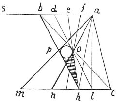
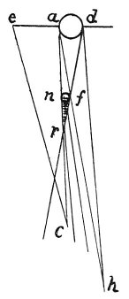

  
[Intangible Textual Heritage](../../index)  [Age of Reason](../index) 
[Index](index)   
[III. Six Books on Light and Shade Index](dvs002)  
  [Previous](0177)  [Next](0179) 

------------------------------------------------------------------------

[Buy this Book at
Amazon.com](https://www.amazon.com/exec/obidos/ASIN/0486225720/internetsacredte)

------------------------------------------------------------------------

*The Da Vinci Notebooks at Intangible Textual Heritage*

### 178.

 

It can be proved why the shadow *o p c h* is darker in proportion as it
is nearer to the line *p h* and is lighter in proportion as it is nearer
to the line *o c*. Let the light *a b*, be a window, and let the dark
wall in which this window is, be *b s*, that is, one of the sides of the
wall.

Then we may say that the line *p h* is darker than any other part of the
space *o p c h*, because this line faces the whole surface in shadow of
 [81](#fn_83)

p. 100

the wall *b s*. The line *o c* is lighter than the other part of this
space *o p c h*, because this line faces the luminous space *a b*.

Where the shadow is larger, or smaller, or equal the body which casts
it.

\[First of the character of divided lights.  [82](#fn_84)

### OF THE COMPOUND SHADOW *F, R, C, H* CAUSED BY A SINGLE LIGHT.

 

The shadow *f r c h* is under such conditions as that where it is
farthest from its inner side it loses depth in proportion. To prove
this:

Let *d a*, be the light and *f n* the solid body, and let *a e* be one
of the side walls of the window that is *d a*. Then I say--according to
the 2nd \[proposition\]: that the surface of any body is affected by the
tone of the objects surrounding it,--that the side *r c*, which faces
the dark wall *a e* must participate of its darkness and, in the same
way that the outer surface which faces the light *d a* participates of
the light; thus we get the outlines of the extremes on each side of the
centre included between them.\]

This is divided into four parts. The first the extremes, which include
the compound shadow, secondly the compound shadow between these
extremes.

------------------------------------------------------------------------

### Footnotes

[99:81](0178.htm#fr_83) : In the original the
diagram is placed between lines 27 and 28.

[100:82](0178.htm#fr_84) 14: *lumi divisi*. The
text here breaks off abruptly.

------------------------------------------------------------------------

[Next: 179.](0179)
