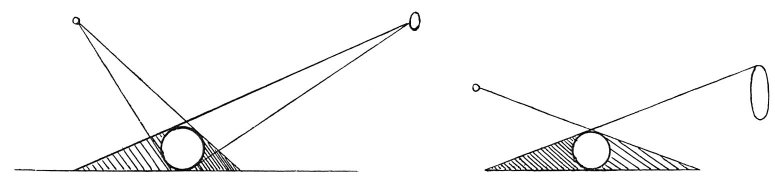

  
[Intangible Textual Heritage](../../index)  [Age of Reason](../index) 
[Index](index)   
[III. Six Books on Light and Shade Index](dvs002)  
  [Previous](0179)  [Next](0181) 

------------------------------------------------------------------------

[Buy this Book at
Amazon.com](https://www.amazon.com/exec/obidos/ASIN/0486225720/internetsacredte)

------------------------------------------------------------------------

*The Da Vinci Notebooks at Intangible Textual Heritage*

### 180.

 

A body in light and shade placed between two equal lights side by side
will cast shadows in proportion to the \[amount of\] light. And the
shadows will be one darker than the other in proportion as one light is
nearer to the said body than the other on the opposite side.

A body placed at an equal distance between two lights will cast two
shadows, one deeper than the other in proportion, as the light which
causes it is brighter than the other.

 [85](#fn_87)

------------------------------------------------------------------------

### Footnotes

[101:85](0180.htm#fr_87) : In the MS. the larger
diagram is placed above the first line; the smaller one between l. 4 &
5.

------------------------------------------------------------------------

[Next: 181.](0181)
