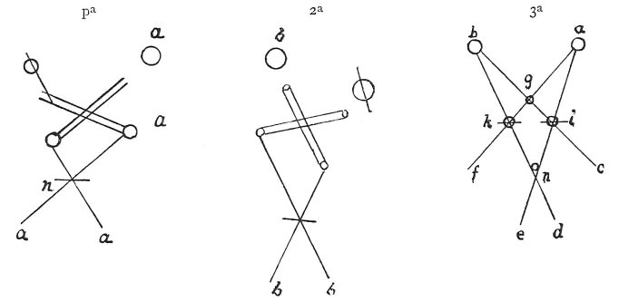

  
[Intangible Textual Heritage](../../index)  [Age of Reason](../index) 
[Index](index)   
[III. Six Books on Light and Shade Index](dvs002)  
  [Previous](0185)  [Next](0187) 

------------------------------------------------------------------------

[Buy this Book at
Amazon.com](https://www.amazon.com/exec/obidos/ASIN/0486225720/internetsacredte)

------------------------------------------------------------------------

*The Da Vinci Notebooks at Intangible Textual Heritage*

### 186.

Why the intersections at *n* being composed of two compound derived
shadows,

 

p. 105

forms a compound shadow and not a simple one, as happens with other
intersections of compound shadows. This occurs, according to the 2nd
\[diagram\] of this \[prop.\] which says:--The intersection of derived
shadows when produced by the intersection of columnar shadows caused by
a single light does not produce a simple shadow. And this is the
corollary of the 1st \[prop.\] which says:--The intersection of simple
derived shadows never results in a deeper shadow, because the deepest
shadows all added together cannot be darker than one by itself. Since,
if many deepest shadows increased in depth by their duplication, they
could not be called the *deepest* shadows, but only part-shadows. But if
such intersections are illuminated by a second light placed between the
eye and the intersecting bodies, then those shadows would become
compound shadows and be uniformly dark just as much at the intersection
as throughout the rest. In the 1st and 2nd above, the intersections *i
k* will not be doubled in depth as it is doubled in quantity. But in
this 3rd, at the intersections *g n* they will be double in depth and in
quantity.

------------------------------------------------------------------------

[Next: 187.](0187)
