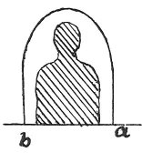

  
[Intangible Textual Heritage](../../index)  [Age of Reason](../index) 
[Index](index)   
[III. Six Books on Light and Shade Index](dvs002)  
  [Previous](0189)  [Next](0191) 

------------------------------------------------------------------------

[Buy this Book at
Amazon.com](https://www.amazon.com/exec/obidos/ASIN/0486225720/internetsacredte)

------------------------------------------------------------------------

*The Da Vinci Notebooks at Intangible Textual Heritage*

### 190.

 

If a window *a b* admits the sunlight into a room, the sunlight will
magnify the size of the window and diminish the shadow of a man in such
a way as that when the man makes that dim shadow of himself, approach to
that which defines the real size of the window, he will see the shadows
where they come into contact, dim and confused from the strength of the
light, shutting off and not allowing the solar rays to pass; the effect
of the shadow of the man cast by this contact will be exactly that
figured above.

 [92](#fn_94)

------------------------------------------------------------------------

### Footnotes

[107:92](0190.htm#fr_94) : It is scarcely
possible to render the meaning of this sentence with strict accuracy;
mainly because the grammatical construction is defective in the most
important part--line 4. In the very slight original sketch the shadow
touches the upper arch of the window and the correction, here given is
perhaps not justified.

------------------------------------------------------------------------

[Next: 191.](0191)
