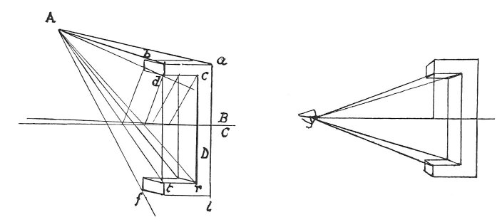

  
[Intangible Textual Heritage](../../index)  [Age of Reason](../index) 
[Index](index)   
[III. Six Books on Light and Shade Index](dvs002)  
  [Previous](0206)  [Next](0208) 

------------------------------------------------------------------------

[Buy this Book at
Amazon.com](https://www.amazon.com/exec/obidos/ASIN/0486225720/internetsacredte)

------------------------------------------------------------------------

*The Da Vinci Notebooks at Intangible Textual Heritage*

### 207.

 

It is impossible that an object mirrored on water should correspond in
form to the object mirrored, since the centre of the eye is above the
surface of the water.

p. 115

This is made plain in the figure here given, which demonstrates that the
eye sees the surface *a b*, and cannot see it at *l f*, and at *r t*; it
sees the surface of the image at *r t*, and does not see it in the real
object *c d*. Hence it is impossible to see it, as has been said above
unless the eye itself is situated on the surface of the water as is
shown below \[13\].

 [100](#fn_102)

------------------------------------------------------------------------

### Footnotes

[115:100](0207.htm#fr_102) : *A* stands for
*ochio* \[eye\], *B* for *aria* \[air\], *C* for *acqua* \[water\], *D*
for *cateto* \[cathetus\].--In the original MS. the second diagram is
placed below line 13.

------------------------------------------------------------------------

[Next: 208.](0208)
