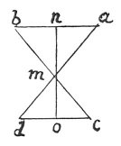

  
[Intangible Textual Heritage](../../index)  [Age of Reason](../index) 
[Index](index)   
[III. Six Books on Light and Shade Index](dvs002)  
  [Previous](0209)  [Next](0211) 

------------------------------------------------------------------------

[Buy this Book at
Amazon.com](https://www.amazon.com/exec/obidos/ASIN/0486225720/internetsacredte)

------------------------------------------------------------------------

*The Da Vinci Notebooks at Intangible Textual Heritage*

### 210.

 

No man can see the image of another man in a mirror in its proper place
with regard to the objects; because every object falls on \[the surface
of\] the mirror at equal angles. And if the one man, who sees the other
in the mirror, is not in a direct line with the image he will not see it
in the place where it really falls; and if he gets into the line, he
covers the other man and puts himself in the place occupied

p. 116

by his image. Let *n o* be the mirror, *b* the eye of your friend and
*d* your own eye. Your friend's eye will appear to you at *a*, and to
him it will seem that yours is at *c*, and the intersection of the
visual rays will occur at *m*, so that either of you touching *m* will
touch the eye of the other man which shall be open. And if you touch the
eye of the other man in the mirror it will seem to him that you are
touching your own.

------------------------------------------------------------------------

[Next: 211.](0211)
