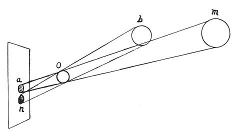

  
[Intangible Textual Heritage](../../index)  [Age of Reason](../index) 
[Index](index)   
[III. Six Books on Light and Shade Index](dvs002)  
  [Previous](0215)  [Next](0217) 

------------------------------------------------------------------------

[Buy this Book at
Amazon.com](https://www.amazon.com/exec/obidos/ASIN/0486225720/internetsacredte)

------------------------------------------------------------------------

*The Da Vinci Notebooks at Intangible Textual Heritage*

### 216.

That part of the surface of a body on which the images \[reflection\]
from other bodies placed opposite fall at the largest angle will assume
their hue most strongly. In the diagram below, 8 is a larger angle than
4, since its base *a n* is larger than *e n* the base of 4. This diagram
below should end at *a n* 4 8. \[4\]That portion of the

p. 120

illuminated surface on which a shadow is cast will be brightest which
lies contiguous to the cast shadow. Just as an object which is lighted
up by a greater quantity of luminous rays becomes brighter, so one on
which a greater quantity of shadow falls, will be darker.

Let 4 be the side of an illuminated surface 4 8, surrounding the cast
shadow *g e* 4. And this spot 4 will be lighter than 8, because less
shadow falls on it than on 8. Since 4 faces only the shadow *i n*; and 8
faces and receives the shadow *a e* as well as *i n* which makes it
twice as dark. And the same thing happens when you put the atmosphere
and the sun in the place of shade and light.

 

 On relative proportion of light and shadows
(216--221).\[12\] The distribution of shadow, originating in, and
limited by, plane surfaces placed near to each other, equal in tone and
directly opposite, will be darker at the ends than at the beginning,
which will be determined by the incidence of the luminous rays. You will
find the same proportion in the depth of the derived shadows *a n* as in
the nearness of the luminous bodies *m b*, which cause them; and if the
luminous bodies were of equal size you would still farther find the same
proportion in the light cast by the luminous circles and their shadows
as in the distance of the said luminous bodies.

 [105](#fn_107)

------------------------------------------------------------------------

### Footnotes

[120:105](0216.htm#fr_107) : The diagram
originally placed between lines 3 and 4 is on [Pl.
VI](pl006.htm#img_pl006), No. 3. In the diagram given above line 14 of
the original, and here printed in the text, the words *corpo luminoso*
\[luminous body\] are written in the circle *m*, *luminoso* in the
circle *b* and *ombroso* \[body in shadow\] in the circle *o*.

------------------------------------------------------------------------

[Next: 217.](0217)
