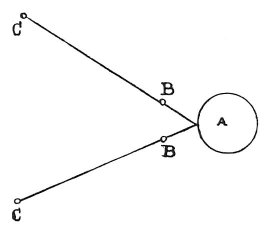

  
[Intangible Textual Heritage](../../index)  [Age of Reason](../index) 
[Index](index)   
[III. Six Books on Light and Shade Index](dvs002)  
  [Previous](0217)  [Next](0219) 

------------------------------------------------------------------------

[Buy this Book at
Amazon.com](https://www.amazon.com/exec/obidos/ASIN/0486225720/internetsacredte)

------------------------------------------------------------------------

*The Da Vinci Notebooks at Intangible Textual Heritage*

### 218.

In all the proportions I lay down it must be understood that the medium
between the bodies is always the same. \[2\] The smaller the luminous
body the more distinct will the transmission of the shadows be.

 

\[3\] When of two opposite shadows, produced by the same body, one is
twice as dark as the other though similar in form, one of the two lights
causing them must have twice the diameter that the other has and be at
twice the distance from the opaque body. If the object is lowly moved
across the luminous body, and the shadow is intercepted at some distance
from the object, there will be the same relative proportion between the
motion of the derived shadow and the motion of the primary shadow, as
between the distance from the object to the light, and that from the
object to the spot where the shadow is intercepted; so that though the
object is moved slowly the shadow moves fast.

 [107](#fn_109)

------------------------------------------------------------------------

### Footnotes

[121:107](0218.htm#fr_109) : There are diagrams
inserted before lines 2 and 3 but they are not reproduced here. The
diagram above line 6 is written upon as follows: at *A lume* (light), at
*B obbietto* (body), at *C ombra d'obbietto* (shadow of the object).

------------------------------------------------------------------------

[Next: 219.](0219)
