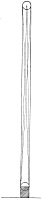

  
[Intangible Textual Heritage](../../index)  [Age of Reason](../index) 
[Index](index)   
[III. Six Books on Light and Shade Index](dvs002)  
  [Previous](0219)  [Next](0221) 

------------------------------------------------------------------------

[Buy this Book at
Amazon.com](https://www.amazon.com/exec/obidos/ASIN/0486225720/internetsacredte)

------------------------------------------------------------------------

*The Da Vinci Notebooks at Intangible Textual Heritage*

### 220.

[  
Click to enlarge](img/v112200.jpg)

A body on which the solar rays fall between the thin branches of trees
far apart will cast but a single shadow.

\[2\] If an opaque body and a luminous one are (both) spherical the base
of the pyramid of rays will bear the same proportion to the luminous
body as the base of the pyramid of shade to the opaque body.

\[4\] When the transmitted shadow is intercepted by a plane surface
placed opposite to it and farther away from the luminous body than from
the object \[which casts it\] it will appear proportionately darker and
the edges more distinct.

 [109](#fn_111)

------------------------------------------------------------------------

### Footnotes

[122:109](0220.htm#fr_111) : The diagram which,
in the original, is placed above line 2, is similar to the one, here
given on page 73 (section 120).--The diagram here given in the margin
stands, in the original, between lines 3 and 4.

------------------------------------------------------------------------

[Next: 221.](0221)
