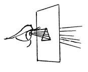

  
[Intangible Textual Heritage](../../index)  [Age of Reason](../index) 
[Index](index)   
[IV. Perspective of Disappearance Index](dvs004)  
  [Previous](0227)  [Next](0229) 

------------------------------------------------------------------------

[Buy this Book at
Amazon.com](https://www.amazon.com/exec/obidos/ASIN/0486225720/internetsacredte)

------------------------------------------------------------------------

*The Da Vinci Notebooks at Intangible Textual Heritage*

### 228.

p. 130

 

The eye cannot take in a luminous angle which is too close to it.

------------------------------------------------------------------------

[Next: 229.](0229)
