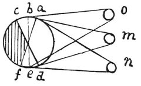

  
[Intangible Textual Heritage](../../index)  [Age of Reason](../index) 
[Index](index)   
[V. Theory of Colours Index](dvs005)  
  [Previous](0270)  [Next](0272) 

------------------------------------------------------------------------

[Buy this Book at
Amazon.com](https://www.amazon.com/exec/obidos/ASIN/0486225720/internetsacredte)

------------------------------------------------------------------------

*The Da Vinci Notebooks at Intangible Textual Heritage*

### 271.

### OF PAINTING.

 

The surface of a body assumes in some degree the hue of those around it.
The colours of illuminated objects are reflected from the surfaces of
one to the other in various spots, according to the various positions of
those objects. Let *o* be a blue object in full light, facing all by
itself the space *b c* on the white sphere *a b e d e f*, and it will
give it a blue tinge, *m* is a yellow body reflected onto the space *a
b* at the same time as *o* the blue body, and they give it a green
colour (by the 2nd \[proposition\] of this which shows that blue and
yellow make a beautiful green &c) And the rest will be set forth in the
Book on Painting. In that Book it will be shown, that, by transmitting
the images of objects and the colours of bodies illuminated by sunlight
through a small round perforation and into a dark chamber onto a plane
surface, which itself is quite white, &c

But every thing will be upside down.

------------------------------------------------------------------------

[Next: 272.](0272)
