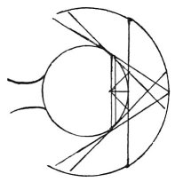

  
[Intangible Textual Heritage](../../index)  [Age of Reason](../index) 
[Index](index)   
[V. Theory of Colours Index](dvs005)  
  [Previous](0273)  [Next](0275) 

------------------------------------------------------------------------

[Buy this Book at
Amazon.com](https://www.amazon.com/exec/obidos/ASIN/0486225720/internetsacredte)

------------------------------------------------------------------------

*The Da Vinci Notebooks at Intangible Textual Heritage*

### 274.

### OF THE INTERSECTIONS OF THE IMAGES IN THE PUPIL OF THE EYE.

The intersections of the images as they enter the pupil do not mingle in
confusion in the space where that intersection unites them; as is
evident, since, if the rays of the sun pass through two panes of glass
in close contact, of which one is blue and the other yellow, the rays,
in penetrating them, do not become blue or yellow but a beautiful green.
And the same thing would happen in the eye, if the images which were
yellow or green should mingle where they \[meet and\] intersect as they
enter the pupil. As this does not happen such a mingling does not exist.

p. 147

 

### OF THE NATURE OF THE RAYS COMPOSED OF THE IMAGES OF OBJECTS, AND OF THEIR INTERSECTIONS.

The directness of the rays which transmit the forms and colours of the
bodies whence they proceed does not tinge the air nor can they affect
each other by contact where they intersect. They affect only the spot
where they vanish and cease to exist, because that spot faces and is
faced by the original source of these rays, and no other object, which
surrounds that original source can be seen by the eye where these rays
are cut off and destroyed, leaving there the spoil they have conveyed to
it. And this is proved by the 4th \[proposition\], on the colour of
bodies, which says: The surface of every opaque body is affected by the
colour of surrounding objects; hence we may conclude that the spot
which, by means of the rays which convey the image, faces--and is faced
by the cause of the image, assumes the colour of that object.

------------------------------------------------------------------------

[Next: 275.](0275)
