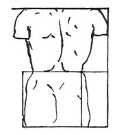

  
[Intangible Textual Heritage](../../index)  [Age of Reason](../index) 
[Index](index)   
[VII. On the Proportions and on the Movements of the Human Figure
Index](dvs007)  
  [Previous](0341)  [Next](0343) 

------------------------------------------------------------------------

[Buy this Book at
Amazon.com](https://www.amazon.com/exec/obidos/ASIN/0486225720/internetsacredte)

------------------------------------------------------------------------

*The Da Vinci Notebooks at Intangible Textual Heritage*

### 342.

 The torso from the front and back.The
width of a man under the arms is the same as at the hips.

A man's width across the hips is equal to the distance from the top of
the hip to the bottom of the buttock, when a man stands

p. 182

 

equally balanced on both feet; and there is the same distance from the
top of the hip to the armpit. The waist, or narrower part above the hips
will be half way between the arm pits and the bottom of the buttock.

 [162](#fn_164)

------------------------------------------------------------------------

### Footnotes

[182:162](0342.htm#fr_164) : The lower sketch
[Pl. XVI](pl016.htm#img_pl016), No. 2, is drawn by the side of line 1.

------------------------------------------------------------------------

[Next: 343.](0343)
