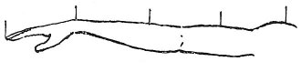

  
[Intangible Textual Heritage](../../index)  [Age of Reason](../index) 
[Index](index)   
[VII. On the Proportions and on the Movements of the Human Figure
Index](dvs007)  
  [Previous](0345)  [Next](0347) 

------------------------------------------------------------------------

[Buy this Book at
Amazon.com](https://www.amazon.com/exec/obidos/ASIN/0486225720/internetsacredte)

------------------------------------------------------------------------

*The Da Vinci Notebooks at Intangible Textual Heritage*

### 346.

 

The hand from the longest finger to the wrist joint goes 4 times from
the tip of the longest finger to the shoulder joint.

------------------------------------------------------------------------

[Next: 347.](0347)
