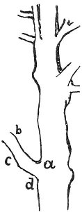

  
[Intangible Textual Heritage](../../index)  [Age of Reason](../index) 
[Index](index)   
[VIII. Botany for Painters and Elements of Landscape Painting
Index](dvs009)  
  [Previous](0400)  [Next](0402) 

------------------------------------------------------------------------

[Buy this Book at
Amazon.com](https://www.amazon.com/exec/obidos/ASIN/0486225720/internetsacredte)

------------------------------------------------------------------------

*The Da Vinci Notebooks at Intangible Textual Heritage*

### 401.

 

In starting from the main stem the branches always form a base with a
prominence as is shown at *a b c d*.

------------------------------------------------------------------------

[Next: 402.](0402)
