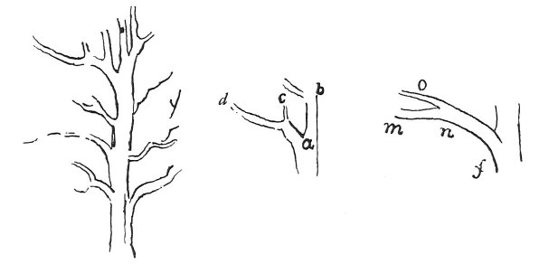

  
[Intangible Textual Heritage](../../index)  [Age of Reason](../index) 
[Index](index)   
[VIII. Botany for Painters and Elements of Landscape Painting
Index](dvs009)  
  [Previous](0406)  [Next](0408) 

------------------------------------------------------------------------

[Buy this Book at
Amazon.com](https://www.amazon.com/exec/obidos/ASIN/0486225720/internetsacredte)

------------------------------------------------------------------------

*The Da Vinci Notebooks at Intangible Textual Heritage*

### 407.

 

The lowest branches, after they have formed the angle of their
separation from the parent stem, always bend downwards so as not to
crowd against the other branches which follow them on the same stem and

p. 210

to be better able to take the air which nourishes them. As is shown by
the angle *b a c*; the branch *a c* after it has made the corner of the
angle *a c* bends downwards to *c d* and the lesser shoot *c* dries up,
being too thin.

The main branch always goes below, as is shown by the branch *f n m*,
which does not go to *f n o*.

------------------------------------------------------------------------

[Next: 408.](0408)
