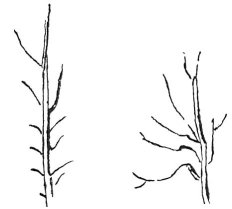

  
[Intangible Textual Heritage](../../index)  [Age of Reason](../index) 
[Index](index)   
[VIII. Botany for Painters and Elements of Landscape Painting
Index](dvs009)  
  [Previous](0407)  [Next](0409) 

------------------------------------------------------------------------

[Buy this Book at
Amazon.com](https://www.amazon.com/exec/obidos/ASIN/0486225720/internetsacredte)

------------------------------------------------------------------------

*The Da Vinci Notebooks at Intangible Textual Heritage*

### 408.

 

 The forms of trees (408--411).The elm
always gives a greater length to the last branches of the year's growth
than to the lower ones; and Nature does this because the highest
branches are those which have to add to the size of the tree; and those
at the bottom must get dry because they grow in the shade and their
growth would be an impediment to the entrance of the solar rays and the
air among the main branches of the tree.

The main branches of the lower part bend down more than those above, so
as to be more oblique than those upper ones, and also because they are
larger and older.

------------------------------------------------------------------------

[Next: 409.](0409)
