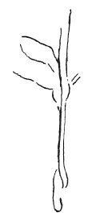

  
[Intangible Textual Heritage](../../index)  [Age of Reason](../index) 
[Index](index)   
[VIII. Botany for Painters and Elements of Landscape Painting
Index](dvs009)  
  [Previous](0408)  [Next](0410) 

------------------------------------------------------------------------

[Buy this Book at
Amazon.com](https://www.amazon.com/exec/obidos/ASIN/0486225720/internetsacredte)

------------------------------------------------------------------------

*The Da Vinci Notebooks at Intangible Textual Heritage*

### 409.

 

In general almost all the upright portions of trees curve somewhat
turning the convexity towards the South; and their branches are longer
and thicker and more abundant towards the South than towards the North.
And this occurs because the sun draws the sap towards that surface of
the tree which is nearest to it.

And this may be observed if the sun is not screened off by other plants.

------------------------------------------------------------------------

[Next: 410.](0410)
