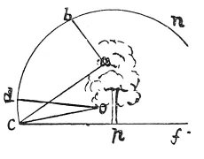

  
[Intangible Textual Heritage](../../index)  [Age of Reason](../index) 
[Index](index)   
[VIII. Botany for Painters and Elements of Landscape Painting
Index](dvs009)  
  [Previous](0435)  [Next](0437) 

------------------------------------------------------------------------

[Buy this Book at
Amazon.com](https://www.amazon.com/exec/obidos/ASIN/0486225720/internetsacredte)

------------------------------------------------------------------------

*The Da Vinci Notebooks at Intangible Textual Heritage*

### 436.

### OF A GENERALLY DISTRIBUTED LIGHT AS LIGHTING UP TREES.

 The proportions of light and shade in trees
(436-440).

That part of the trees will be seen to lie in the least dark shadow
which is farthest from the earth.

 

To prove it let *a p* be the tree, *n b c* the illuminated hemisphere
\[the sky\], the under portion of the tree faces the earth *p c*, that
is on the side *o*, and it faces a small part of the hemisphere at *c
d*. But the highest part of the convexity a faces the greatest part of
the hemisphere, that is *b c*. For this reason--and because it does not
face the darkness of the earth--it is in fuller light. But if the tree
has dense foliage, as the laurel, arbutus, box or holm oak, it will be
different; because, although *a* does not face the earth, it faces the
dark \[green\] of the leaves cut up by many shadows, and this darkness
is reflected onto the under sides of the leaves immediately above. Thus
these trees have their darkest shadows nearest to the middle of the
tree.

------------------------------------------------------------------------

[Next: 437.](0437)
