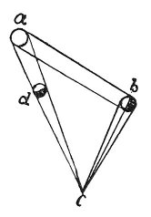

  
[Intangible Textual Heritage](../../index)  [Age of Reason](../index) 
[Index](index)   
[VIII. Botany for Painters and Elements of Landscape Painting
Index](dvs009)  
  [Previous](0439)  [Next](0441) 

------------------------------------------------------------------------

[Buy this Book at
Amazon.com](https://www.amazon.com/exec/obidos/ASIN/0486225720/internetsacredte)

------------------------------------------------------------------------

*The Da Vinci Notebooks at Intangible Textual Heritage*

### 440.

### ON PAINTING.

In the position of the eye which sees that portion of a tree illuminated
which turns towards the light, one tree will never be seen to be
illuminated equally with the other. To prove this, let the eye be *c*
which sees

p. 222

 

the two trees *b d* which are illuminated by the sun *a*; I say that
this eye *c* will not see the light in the same proportion to the shade,
in one tree as in the other. Because, the tree which is nearest to the
sun will display so much the stronger shadow than the more distant one,
in proportion as one tree is nearer to the rays of the sun that converge
to the eye than the other; &c

You see that the eye *c* sees nothing of the tree *d* but shadow, while
the same eye *c* sees thè tree *b* half in light and half in shade.

When a tree is seen from below, the eye sees the top of it as placed
within the circle made by its boughs\[23\].

Remember, O Painter! that the variety of depth of shade in any one
particular species of tree is in proportion to the rarity or density of
their branches.

 [218](#fn_220)

------------------------------------------------------------------------

### Footnotes

[222:218](0440.htm#fr_220) : The two lower
sketches on the left of Pl XXVIII, No. 3, refer to lines 21-23. The
upper sketch has apparently been effaced by Leonardo himself.

------------------------------------------------------------------------

[Next: 441.](0441)
