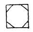

  
[Intangible Textual Heritage](../../index)  [Age of Reason](../index) 
[Index](index)   
[VIII. Botany for Painters and Elements of Landscape Painting
Index](dvs009)  
  [Previous](0450)  [Next](0452) 

------------------------------------------------------------------------

[Buy this Book at
Amazon.com](https://www.amazon.com/exec/obidos/ASIN/0486225720/internetsacredte)

------------------------------------------------------------------------

*The Da Vinci Notebooks at Intangible Textual Heritage*

### 451.

### OF TREES.

What outlines are seen in trees at a distance against the sky which
serves as their background?

The outlines of the ramification of trees, where they lie against the
illuminated sky, display a form which more nearly approaches the
spherical on proportion as they are remote, and the nearer they are the
less they appear in this spherical form; as in the first tree *a* which,
being near to the eye,

p. 227

 

displays the true form of its ramification; but this shows less in *b*
and is altogether lost in *c*, where not merely the branches of the tree
cannot be seen but the whole tree is distinguished with difficulty.
Every object in shadow, of whatever form it may be, at a great distance
appears to be spherical. And this occurs because, if it is a square
body, at a very short distance it loses its angles, and a little farther
off it loses still more of its smaller sides which remain. And thus
before the whole is lost \[to sight\] the parts are lost, being smaller
than the whole; as a man, who in such a distant position loses his legs,
arms and head before \[the mass of\] his body, then the outlines of
length are lost before those of breadth, and where they have become
equal it would be a square if the angles remained; but as they are lost
it is round.

 [221](#fn_223)

------------------------------------------------------------------------

### Footnotes

[227:221](0451.htm#fr_223) : The sketch No. 4,
[Pl. XXVIII](pl028.htm#img_pl028), belongs to this passage.

------------------------------------------------------------------------

[Next: 452.](0452)
