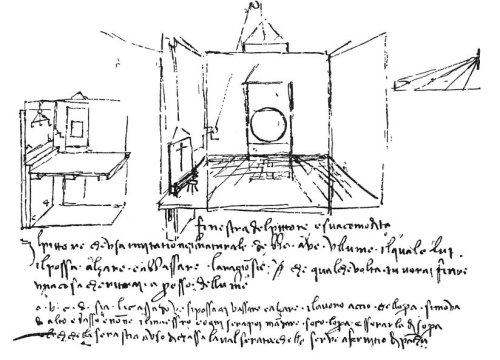

  
[Intangible Textual Heritage](../../index)  [Age of Reason](../index) 
[Index](index)   
[IX. The Practice of Painting Index](dvs010)  
  [Previous](0511)  [Next](0513) 

------------------------------------------------------------------------

[Buy this Book at
Amazon.com](https://www.amazon.com/exec/obidos/ASIN/0486225720/internetsacredte)

------------------------------------------------------------------------

*The Da Vinci Notebooks at Intangible Textual Heritage*

### 512.

### OF THE PAINTER'S WINDOW AND ITS ADVANTAGE.

The painter who works from nature should have a window, which he can
raise

 

p. 257

and lower. The reason is that sometimes you will want to finish a thing
you are drawing, close to the light.

Let *a b c d* be the chest on which the work may be raised or lowered,
so that the work moves up and down and not the painter. And every
evening you can let down the work and shut it up above so that in the
evening it may be in the fashion of a chest which, when shut up, may
serve the purpose of a bench.

 [244](#fn_246)

------------------------------------------------------------------------

### Footnotes

[257:244](0512.htm#fr_246) : See [Pl.
XXXI](pl031.htm#img_pl031), No. 2. In this plate the lines have
unfortunately lost their sharpness, for the accidental loss of the
negative has necessitated a reproduction from a positive. But having
formerly published this sketch by another process, in VON LUTZOW'S
*Zeitschrift fur bildende Kunst* (Vol. XVII, pg. 13) I have reproduced
it here in the text. The sharpness of the outline in the original sketch
is here preserved but it gives it from the reversed side.

------------------------------------------------------------------------

[Next: 513.](0513)
