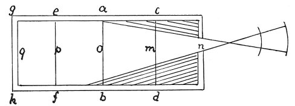

  
[Intangible Textual Heritage](../../index)  [Age of Reason](../index) 
[Index](index)   
[IX. The Practice of Painting Index](dvs010)  
  [Previous](0516)  [Next](0518) 

------------------------------------------------------------------------

[Buy this Book at
Amazon.com](https://www.amazon.com/exec/obidos/ASIN/0486225720/internetsacredte)

------------------------------------------------------------------------

*The Da Vinci Notebooks at Intangible Textual Heritage*

### 517.

 

### PAINTING.

The luminous air which enters by passing through orifices in walls into
dark rooms will render the place less dark in proportion as the opening
cuts into the walls which surround and cover in the pavement.

------------------------------------------------------------------------

[Next: 518.](0518)
