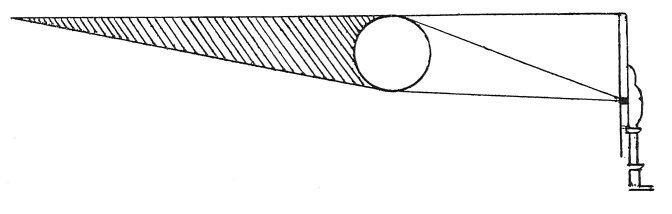

  
[Intangible Textual Heritage](../../index)  [Age of Reason](../index) 
[Index](index)   
[IX. The Practice of Painting Index](dvs010)  
  [Previous](0524)  [Next](0526) 

------------------------------------------------------------------------

[Buy this Book at
Amazon.com](https://www.amazon.com/exec/obidos/ASIN/0486225720/internetsacredte)

------------------------------------------------------------------------

*The Da Vinci Notebooks at Intangible Textual Heritage*

### 525.

If you want to represent a figure on a wall, the wall being
foreshortened, while the figure is to appear in its proper form, and as
standing free from the wall, you must proceed thus: have a thin plate of
iron and make a small hole in the centre; this hole must be round. Set a
light close to it in such a position as that it shines

 

through the central hole, then place any object or figure you please so
close to the wall that it touches it and draw the outline of the shadow
on the wall; then fill in the shade and add the lights; place the person
who is to see it so that he looks through that same hole where at first
the light was; and you will never be able to persuade yourself that the
image is not detached from the wall.

 [250](#fn_252)

------------------------------------------------------------------------

### Footnotes

[262:250](0525.htm#fr_252) : *uno piccolo
spiracelo nel mezzo*. M. RAVAISSON, in his edition of MS. A (Paris), p.
52, reads *nel muro*--evidently a mistake for *nel mezzo* which is quite
plainly written; and he translates it *"fait lui une petite ouverture
dans le mur,"* adding in a note: *"les mots 'dans le mur' paraissent
etre de trop. Leonardo a du les ecrire par distraction"* But *'nel
mezzo'* is clearly legible even on the photograph facsimile given by
Ravaisson himself, and the objection he raises disappears at once. It is
not always wise or safe to try to prove our author's absence of mind or
inadvertence by apparent difficulties in the sense or connection of the
text.

------------------------------------------------------------------------

[Next: 526.](0526)
