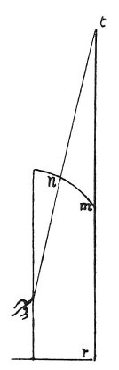

  
[Intangible Textual Heritage](../../index)  [Age of Reason](../index) 
[Index](index)   
[IX. The Practice of Painting Index](dvs010)  
  [Previous](0525)  [Next](0527) 

------------------------------------------------------------------------

[Buy this Book at
Amazon.com](https://www.amazon.com/exec/obidos/ASIN/0486225720/internetsacredte)

------------------------------------------------------------------------

*The Da Vinci Notebooks at Intangible Textual Heritage*

### 526.

p. 263

 

### TO DRAW A FIGURE ON A WALL 12 BRACCIA HIGH WHICH SHALL LOOK 24 BRACCIA HIGH.

If you wish to draw a figure or any other object to look 24 braccia high
you must do it in this way. First, on the surface *m r* draw half the
man you wish to represent; then the other half; then put on the vault *m
n* \[the rest of\] the figure spoken of above; first set out the
vertical plane on the floor of a room of the same shape as the wall with
the coved part on which you are to paint your figure. Then, behind it,
draw a figure set out in profile of whatever size you please, and draw
lines from it to the point *f* and, as these lines cut *m n* on the
vertical plane, so will the figure come on the wall, of which the
vertical plane gives a likeness, and you will have all the \[relative\]
heights and prominences of the figure. And the breadth or thickness
which are on the upright wall *m n* are to be drawn in their proper
form, since, as the wall recedes the figure will be foreshortened by
itself; but \[that part of\] the figure which goes into the cove you
must foreshorten, as if it were standing upright; this diminution you
must set out on a flat floor and there must stand the figure which is to
be transferred from the vertical plane *r n* [251](#fn_253) in its real size and reduce it once
more on a vertical plane; and this will be a good method  [252](#fn_254) .

 [253](#fn_255)

------------------------------------------------------------------------

### Footnotes

[263:251](0526.htm#fr_253) 17: *che leverai
dalla pariete r n*. The letters refer to the larger sketch, No. 3 on
[Pl. XXXI](pl031.htm#img_pl031).

[263:252](0526.htm#fr_254) 18: Leonardo here
says nothing as to how the image foreshortened by perspective and thus
produced on the vertical plane is to be transferred to the wall; but
from what is said in Nos. 525 and 523 we may conclude that he was
familiar with the process of casting the enlarged shadow of a squaring
net on the surface of a wall to guide him in drawing the figure.

*Pariete di rilieuo; "sur une parai en relief"* (RAVAISSON). *"Auf einer
Schnittlinie zum Aufrichten"* (LUDWIG). The explanation of this puzzling
expression must be sought in No. 545, lines 15-17.

[263:253](0526.htm#fr_255) : See [Pl.
XXXI](pl031.htm#img_pl031). 3. The second sketch, which in the plate is
incomplete, is here reproduced and completed from the original to
illustrate the text. In the original the larger diagram is placed
between lines 5 and 6.

1\. 2. C. A. 157a; 463a has the similar heading: '*del cressciere della
figura*', and the text begins: "*Se voli fare 1a figura grande* b c" but
here it breaks off. The translation here given renders the meaning of
the passage as I think it must be understood. The MS. is perfectly
legible and the construction of the sentence is simple and clear;
difficulties can only arise from the very fullness of the meaning,
particularly towards the end of the passage.

------------------------------------------------------------------------

[Next: 527.](0527)
