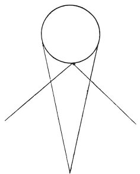

  
[Intangible Textual Heritage](../../index)  [Age of Reason](../index) 
[Index](index)   
[IX. The Practice of Painting Index](dvs010)  
  [Previous](0526)  [Next](0528) 

------------------------------------------------------------------------

[Buy this Book at
Amazon.com](https://www.amazon.com/exec/obidos/ASIN/0486225720/internetsacredte)

------------------------------------------------------------------------

*The Da Vinci Notebooks at Intangible Textual Heritage*

### 527.

p. 264

 

If you would to draw a cube in an angle of a wall, first draw the object
in its own proper shape and raise it onto a vertical plane until it
resembles the angle in which the said object is to be represented.

------------------------------------------------------------------------

[Next: 528.](0528)
