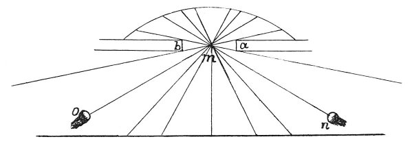

  
[Intangible Textual Heritage](../../index)  [Age of Reason](../index) 
[Index](index)   
[IX. The Practice of Painting Index](dvs010)  
  [Previous](0548)  [Next](0550) 

------------------------------------------------------------------------

[Buy this Book at
Amazon.com](https://www.amazon.com/exec/obidos/ASIN/0486225720/internetsacredte)

------------------------------------------------------------------------

*The Da Vinci Notebooks at Intangible Textual Heritage*

### 549.

### HOW THE PAINTER MUST PLACE HIMSELF WITH REFERENCE TO THE LIGHT, TO GIVE THE EFFECT OF RELIEF.

 On the choice of light for a picture
(549-554).Let *a b* be the window, *m* the point of light. I say
that on whichever side the painter places himself he will be well placed

 

if only his eye is between the shaded and the illuminated portions of
the object he is drawing; and this place you will find by putting
yourself between the point *m* and the division between the shadow and
the light on the object to be drawn.

------------------------------------------------------------------------

[Next: 550.](0550)
