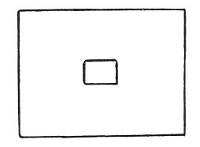

  
[Intangible Textual Heritage](../../index)  [Age of Reason](../index) 
[Index](index)   
[X. Studies and Sketches for Pictures and Decorations Index](dvs011)  
  [Previous](0678)  [Next](0680) 

------------------------------------------------------------------------

[Buy this Book at
Amazon.com](https://www.amazon.com/exec/obidos/ASIN/0486225720/internetsacredte)

------------------------------------------------------------------------

*The Da Vinci Notebooks at Intangible Textual Heritage*

### 679.

 

 Arrangement of a Picture.  John the
Baptist  
  Saint Augustin  
  Saint Peter  
  Paul  
  Elisabeth  
  Saint Clara.  
  Bernardino  
  Our Lady Louis  
  Bonaventura  
  Anthony of Padua.  
  Saint Francis.  
  Francis,  
  Anthony, a lily and book;  
  Bernardino with the \[monogram of\] Jesus,  
  Louis with 3 fleur de lys on his breast and  
              the crown at his feet,  
  Bonaventura with Seraphim,  
  Saint Clara with the tabernacle,  
  Elisabeth with a Queen's crown.  

 [315](#fn_317)

------------------------------------------------------------------------

### Footnotes

[354:315](0679.htm#fr_317) : 679. The text of
the first six lines is written within a square space of the same size as
the copy here given. The names are written in the margin following the
order in which they are here printed. In lines 7--12 the names of those
saints are repeated of whom it seemed necessary to point out the
emblems.

------------------------------------------------------------------------

[Next: 680.](0680)
